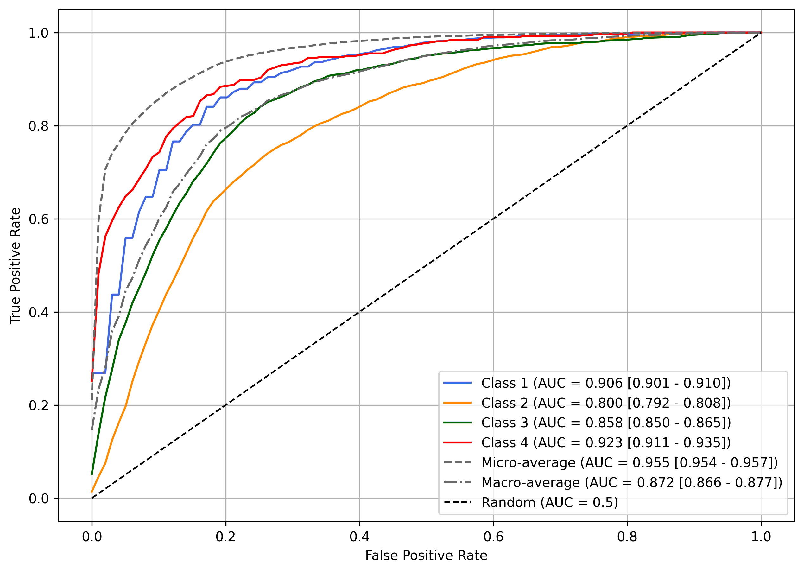

# ASCVD Risk Classification using Machine Learning

This project focuses on training and evaluating six machine learning models to classify the risk of Atherosclerotic Cardiovascular Disease (ASCVD) based on anthropometric and body composition features. 

All models follow a standardized pipeline comprising:
- Data pipeline setup  
- Model training and tuning  
- Bootstrapped performance evaluation  
- Model interpretability via SHAP values  

[svm_rbf.ipynb](svm_rbf.ipynb) notebook contains the full code and results for the top-performing model: Support Vector Machine (SVM) with RBF kernel, which achieved the highest micro-average AUC.

Other models follow the same methodological framework and we will have an overview of their implementation and results in the following sections.

---

## Dataset

The notebooks assume the data is provided in an Excel file named cohort.xlsx, with the following features:

- **bmi**: Body Mass Index  
- **hc**: Hip Circumference  
- **wc**: Waist Circumference  
- **bf**: Body Fat Percentage  
- **ffm**: Fat-Free Mass  

The target variable is:

- **ascvd**: A categorical label indicating ASCVD risk.  
  ASCVD risk was calculated using the ACC/AHA ASCVD Risk Estimator. Individuals are classified into 4 classes:

  1. **Low risk**: < 5%  
  2. **Borderline risk**: 5% to <7.5%  
  3. **Intermediate risk**: 7.5% to <20% 
  4. **High risk**: ≥ 20%


Note: The dataset used in this project contains patient information that cannot be shared publicly. If you wish to replicate the workflow, you may use a similarly structured dataset with synthetic data.

Note: For further details on the dataset structure, check the notebook : [dataset_inspection.ipynb](dataset_inspection.ipynb) 

---

## Common Steps for All Models

### Preprocessing
- **Feature Scaling**: StandardScaler (if applicable)
- **Class Balancing**: BorderlineSMOTE

### Evaluation

#### Nested Cross-Validation
- **Outer CV**: 5-fold stratified, repeated 20 times (total of 100 outer folds)
- **Inner CV**: 10-fold stratified within each outer fold to perform hyperparameter tuning 

#### Metrics Computed
- **Accuracy**
- **Precision, Recall, F1-score** (per-class, macro/micro averaged)
- **ROC AUC** (per-class, macro/micro averaged)
- **Log Loss** (baseline for uniform predictions: 1.386)
- **Brier Score** (baseline for uniform predictions: 0.75)

#### Bootstrapping
- bootstrap resampling with 1000 iterations on metric values from 100 outer folds
- Estimates mean and 95% CIs for each metric

---

## Models and Pipelines

### 1. Logistic Regression 
**Pipeline:**  
StandardScaler -> BorderlineSMOTE -> LogisticRegression

**Hyperparameters Tuned:**
```python
{
  'logreg__C': [0.01, 0.1, 1, 10, 100]
}
```

---

### 2. Linear SVM
**Pipeline:**  
StandardScaler -> BorderlineSMOTE -> SVC (linear Kernel)

**Hyperparameters Tuned:**
```python
{
  'svm__C': [0.1, 1, 10, 100],
}
```

---

### 3. SVM with RBF Kernel
**Pipeline:**  
StandardScaler -> BorderlineSMOTE -> SVC (RBF Kernel)

**Hyperparameters Tuned:**
```python
{
  'svm__C': [0.1, 1, 10, 100],
  'svm__gamma': [0.01 , 0.1]
}
```

---

### 4. k-Nearest Neighbors 
**Pipeline:**  
StandardScaler -> BorderlineSMOTE -> KNeighborsClassifier

**Hyperparameters Tuned:**
```python
{
  'knn__n_neighbors': [3, 5, 7, 9],
  'knn__weights': ['uniform', 'distance']
}
```

---

### 5. XGBoost 
**Pipeline:**  
BorderlineSMOTE -> XGBClassifier

**Hyperparameters Tuned:**
```python
{
  'xgb__n_estimators': [500],
  'xgb__max_depth': [5, 9],
  'xgb__learning_rate': [0.01, 0.1]
}
```

---

### 6. Random Forest 
**Pipeline:**  
BorderlineSMOTE -> RandomForestClassifier

**Hyperparameters Tuned:**
```python
{
  'rf__n_estimators': [1000],
  'rf__max_depth': [7, 15]
}
```
---

## Evaluation Summary and ROC Visualization


## Model-Specific ROC Curves


### SVM with RBF Kernel


The ROC curve above shows the performance of the SVM model with an RBF kernel, including bootstrapped CIs.


### ROC Curve Thumbnail for Other Models


| Model | ROC Curve |
|-------|-----------|
| Logistic Regression | [](plots/logistic_regression_roc_curve.png) |
| Linear SVM | [](plots/linearsvm_roc_curve.png) |
| k-Nearest Neighbors | [](plots/knn_roc_curve.png) |
| XGBoost | [](plots/xgboost_roc_curve.png) |
| Random Forest | [](plots/randomforest_roc_curve.png) |


###  Model Comparison Based on Micro-average AUC


###  Model Comparison Based on Macro-average AUC


---

## SHAP Explainability

The SVM with RBF Kernel, trained on the full dataset using optimal hyperparameters, has been interpreted using **SHAP**:

### SHAP Feature Importance


### SHAP Summary Plots
- Computes SHAP values to explain predictions
- Generates:
  - Class-specific summary plots (feature impact per class)
  - Aggregate bar plot showing overall feature importance
([svm_rbf.ipynb](svm_rbf.ipynb))

### SHAP Force Plots
- Provides individualized prediction explanations for a specific instance across classes

Plots available in the [svm_rbf.ipynb](svm_rbf.ipynb) notebook

---

## Stratified Cohort 

SVM with RBF kernel was retrained on a stratified cohort of males aged 40–70—a group large enough to ensure sufficient training data—thereby reducing age- and sex-related confounding effects while focusing on anthropometric predictors. Comprehensive results are provided in [svm_rbf_stratifiedcohort.ipynb](svm_rbf_stratifiedcohort.ipynb).


